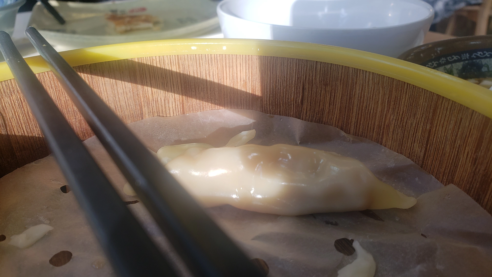
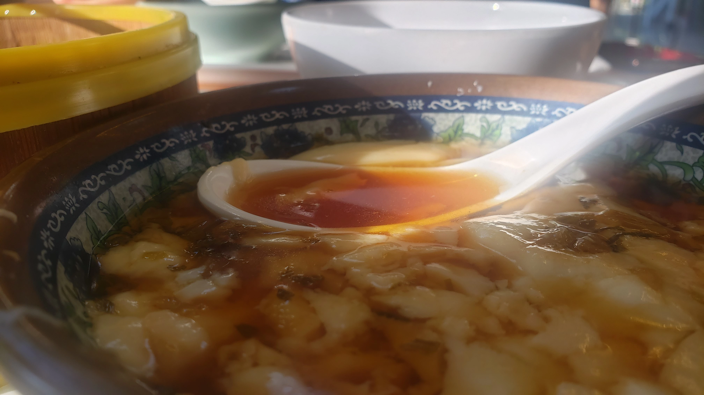

## 线下课的第一天

自2022年3月8日至3月9日交界之时，交大已经线上教学了长达228.5天。

回想开学之初的半天线下课，在当时倍感平常，以为这不过是交大逐步走向正常化的一小步，却未曾预料，那会是这近230天内唯一的线下课时光。

过去的时光里，一周又一周，每天晚上感到身体将要浸入那黑暗的朦胧之前，我总会迷迷糊糊地想着“下周差不多该线下了吧……？”但得到的回应却只有一次又一次的“Still Online”。

而就在今天，正如当初突如其来的封校一样，开放线下教学的通知同样是让所有人都倍感突然，以至于当我早上7点醒来，仍在疑惑自己为什么定了这么早的闹钟

“嗯？这么早？哦，原来今天是线下课”

坐在食堂之中，环视我身边的人群，我仍然有些许恍惚，但面前的早餐在阳光下冒出热气却提醒着我一切并非虚幻。

“这或许才是校园本该有的样子”

## 早餐

二餐的蒸饺和豆腐脑 QvQ

蒸饺好吃 QwQ

豆腐脑也好吃 :P

## 电路课

很亢奋地感到困，或许是网课后遗症

## 体育课

《才跑了十分钟就腰酸背痛提醒我已经宅在寝室接近一个半月没运动了》

## 大学物理

感觉教学效果比线上好

## ……之后？

一切似乎总算开始向好的方向发展了，感谢你看到这里，愿你生活如意，我的老伙计或者陌生人，:)
